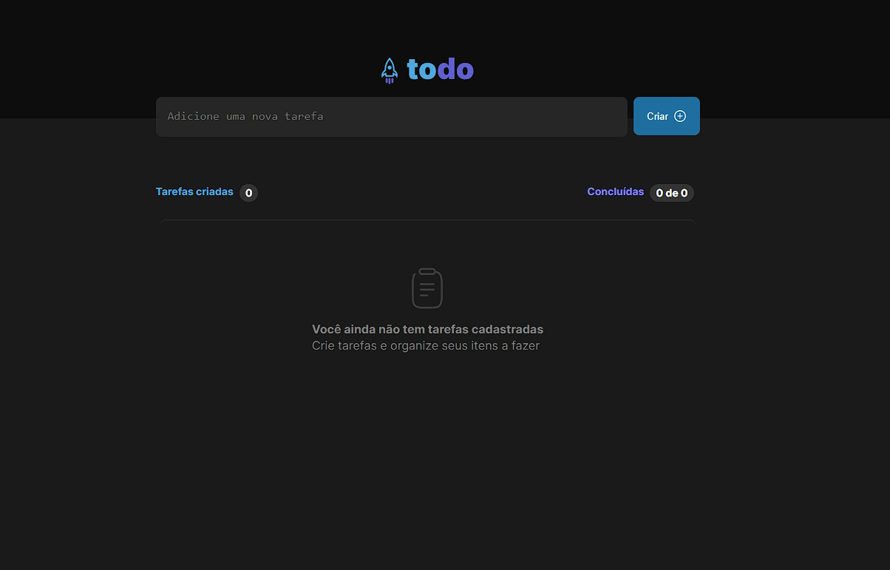
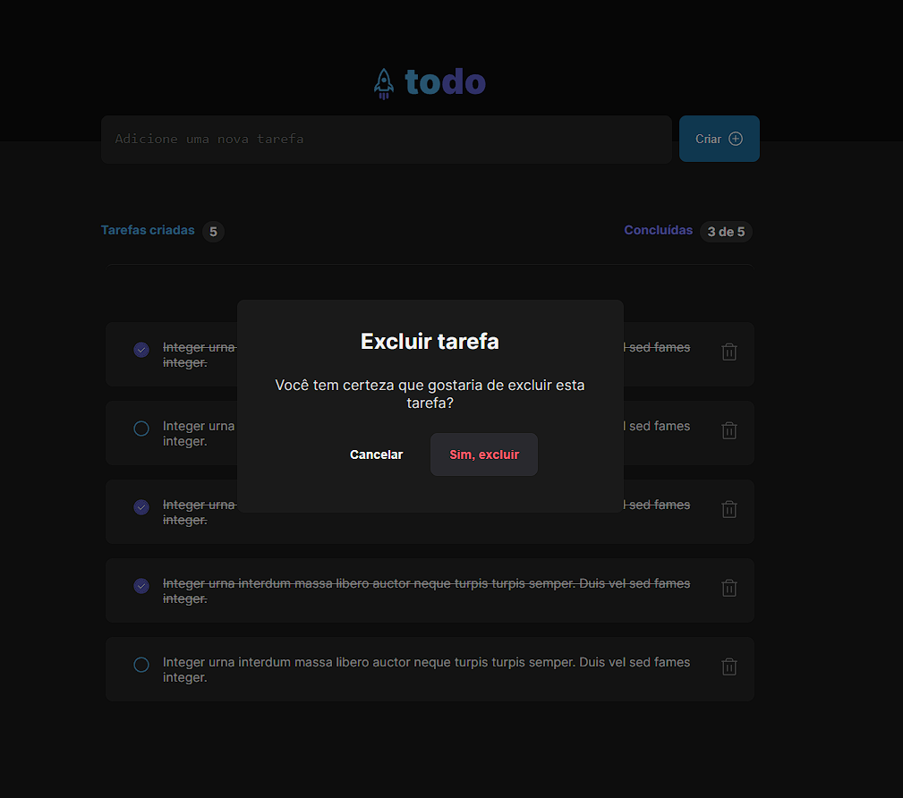

</div>

## ▶ Preview

[](https://to-do-list-six-psi.vercel.app/)

## 📃 About

Todo List, trata-se de um projeto que tem como objetivo o gerenciamento de tarefas do usuário, em que o qual, além de adicionar novas tarefas, pode também marca-lás como concluidas ou deleta-las.

## 🎨 Layout

- [Layout Figma - Original](https://www.figma.com/file/Mw55m5AwkLzwjSthKDD4YK/ToDo-List-(Copy)?node-id=43%3A88&t=h1lWXaQAJbvtZ1QY-0)

## 🛠 Build with

- [HTML]()
- [CSS]()
- [TypeScript]()

## 🎞 Demo





## ⚙ Features


## 💻 Getting started

```sh
git clone https://github.com/GuiOrlandin/toDo-List.git && cd toDo-List
```

Download [live server](https://marketplace.visualstudio.com/items?itemName=ritwickdey.LiveServer) extension on vscode and run.